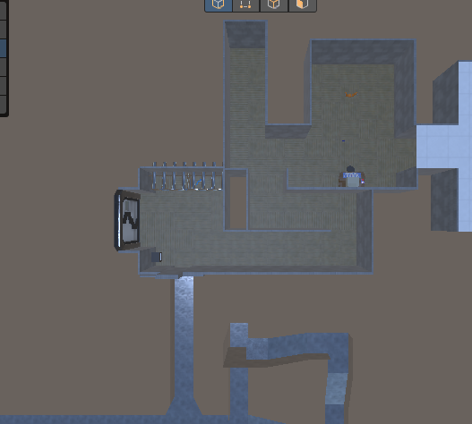
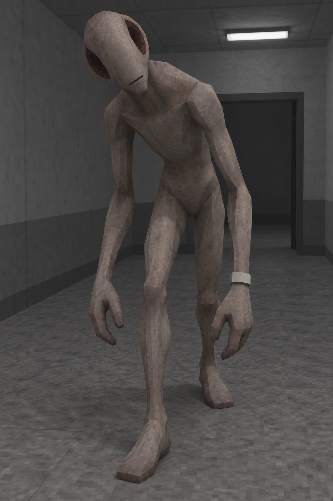
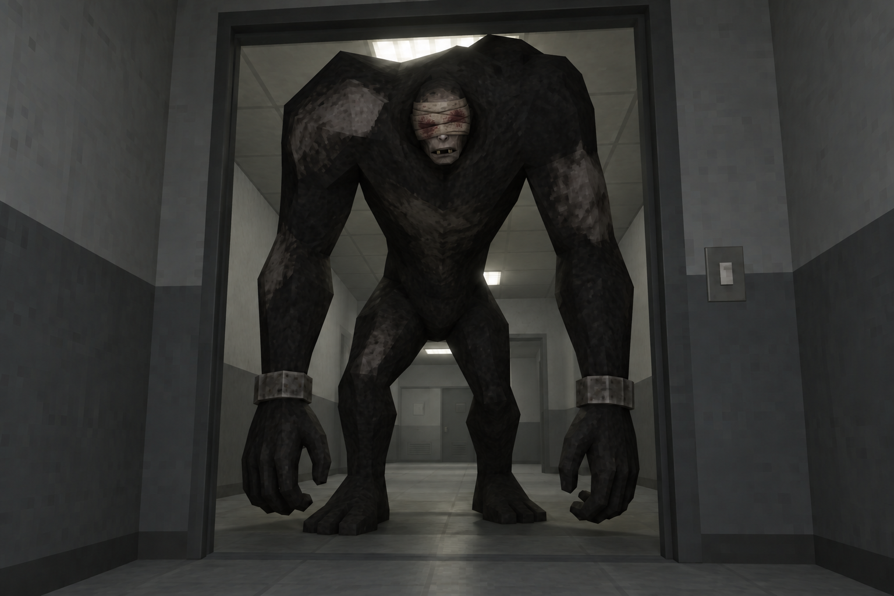
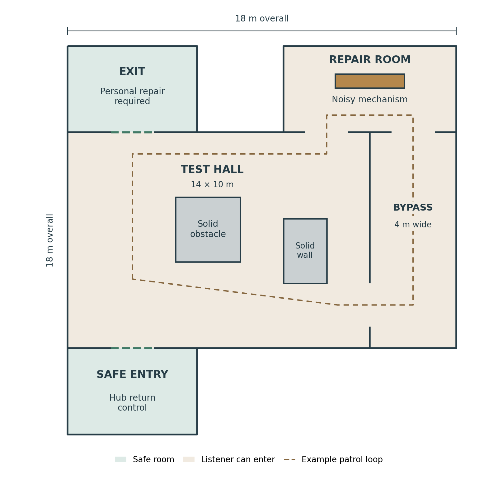
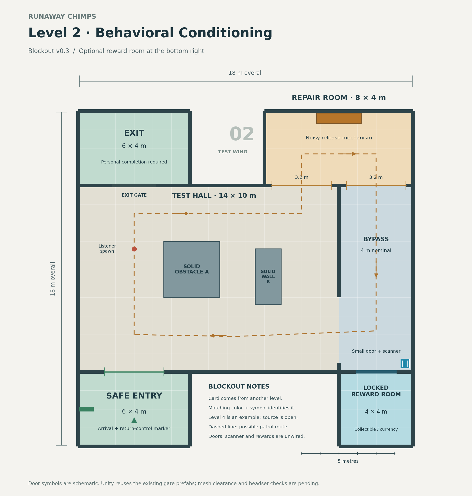

# Runaway Chimps design and lore

Last updated: 2026-09-12. Maintained repository edition, migrated from `Runaway_Chimps_Design_and_Lore.docx` version 0.9. The existing Word document is a downloadable snapshot; future edits belong here. See [AGENTS.md](../AGENTS.md) for the documentation workflow and the [repository improvement plan](repository-improvement-plan.md) for implementation evidence.

We are building a social VR horror game about gorillas escaping a laboratory that experiments on animals. This document records the current game rules, Level 1, the proposed Listener level, the story, and the scene architecture so future work can build on the same decisions.

## Implementation status

Design approval is separate from implementation and testing. **Confirmed** records an explicit design decision; **Planned** records an accepted direction awaiting implementation; **Proposed** is an idea awaiting agreement; **Open** is an unresolved choice. **Implemented** means code exists on a named branch or commit, not necessarily on `main`. **Pending validation** names checks not yet run. Mark something **Validated** only with an actual result, date, and tested version or commit.

As of 2026-09-09, [PR #2](https://github.com/GregStephen/RunawayChimps/pull/2), merged on 2026-09-09, contains the local vent-audio, proximity-reset, material-safety, and ten-player default changes in commit `d4ee616`. Unity compilation, Play Mode, Photon sessions, and headset checks are pending. These changes do not implement the scene split, shared monster synchronization, Zombie Crawl integration, or personal-card lifecycle. Follow [Checks before merging](../README.md#checks-before-merging).

On `level1split`, commit `ac69718` contains `Assets/Scenes/Level1_Containment.unity` and its metadata. Greg reports that the new scene and doors are committed. The follow-up build-settings change enables this scene after Bootstrap, Loading, and Hub_Base. The travel implementation prepared for `level1split` now adds guarded local loading, door/computer routes, separate Hub arrival markers, persistent XR interaction management, sector avatar/collision/voice presentation, and sector monster state messages. Unity compilation, extraction geometry, headset arrival clearance, and multiplayer validation remain pending; see the [travel checks](../README.md#scene-travel-checks).

The gameplay rules below describe the intended game. Reported local behavior is identified separately from what the repository review established.

The combined `level1split-travel.patch` also includes focused source cleanup for terminal color saving/preview and name-save handling, local startup readiness, cancelled/timeout player spawning, button release state, logging, material bindings, hand-impact audio, and held-item collision-layer restoration. The held-item script filename now matches its existing component class with its asset GUID preserved. The Level 1 travel/cleanup work is now on main through merged PR #3; no separate patch application is needed. These changes add no Level 1 terminal or new gameplay/progression rules; Unity and headset validation remain pending.

**September 10 integration status:** PR #4 is merged into `main` at `8657c3e`, including the Level 2 blockout, Level 2 travel routes, personal Level 1 completion handoff, and RETURN TO SECURITY control. PR #5 (`codex/codebase-reliability-audit`) was reconciled with that mainline in branch commit `ad1a424` and then merged to `main` in merge commit `a23bd3e` on September 11. The conflict resolution preserves PR #4's Level 2 behavior and personal-card pickup checks while adding the audit branch's startup, room-switch, reconnect/pause, validator, filename, and reliability fixes. This records implementation state only: the combined five-scene tree still requires the offline source checker to be rerun, followed by Unity 2022.3.55f1, Photon, and headset validation.

**September 11 Level 2 design correction:** Greg confirmed that the current 18 × 18 m Level 2 blockout is too small and that the replacement must be at least twice as large in both length and width, making **36 × 36 m the minimum target footprint**. This supersedes the earlier instruction to keep the Listener level small. Branch `design/level2-expanded-map-v04` now contains an **implemented v0.4 review blockout** at that minimum footprint, generated as the existing Level 2 scene/prefab with the travel contract preserved. Greg reviewed the v0.4 fuse-power blockout and confirmed the current room sizing/proportions. Obstacle placement, ceiling judgment, final Listener clearances and runtime navigation remain subject to validation/tuning. `main` now contains the merged v0.4 blockout through PR #7. Source/box-route validation has passed on v0.4; Unity 2022.3.55f1, Photon and headset validation remain pending.

**September 11 Level 1 runtime follow-up:** after the first Zombie Crawl integration and emergency lighting fallback reached `main` through PR #8, Greg reported that Level 1 remained almost impossible to see, Zombie Crawl rendered far too small, translated without convincing crawl motion, did not appear to pursue the player, and did not capture on ordinary player contact. Branch `codex/fix-level1-crawler-lighting` now implements a focused correction: a brighter but still cool/shadowless readable baseline, authored-world-scale preservation for Zombie Crawl, retuned crawl/chase pacing and detection, local-rig contact capture, and a directional safe-room-to-vent zone repair for the second Level 1 route. A follow-up source pass further makes both safe-room boundaries head-authoritative, retries capture during continued overlap, records card drops from the Gorilla body position, restricts Zombie lookup to its own scene including inactive authored objects, restarts a non-looping crawl state while moving, and keeps the shared Crawler Animator active independently of the local viewer's safe-room audio gate. This is implemented source behavior, not yet Unity/headset validation.

**September 11 Crawler visual-path correction:** Greg's next runtime test supersedes any implication that the earlier crawl-playback work was visually successful: Zombie Crawl still showed no visible crawl animation, could appear several meters away from the invisible moving gameplay rig, and its long rigid body could leave the vent volume, especially around corners. A rigid visual child that simply rotates with the NavMesh root is therefore not an acceptable final Crawler presentation. On `codex/fix-level1-crawler-lighting`, commits `5f5ea84` and `97b20e6` now implement a dedicated visual anchor, chest/spine/hips alignment instead of trusting the FBX root pivot, render-bounds floor placement, a seeded recent-path history that lets the torso sample progressively older positions/headings around turns, bounded hand-to-wall containment, and explicit crawl-state/bone-motion diagnostics with one automatic Animator rebind/restart. The gameplay root remains authoritative for navigation, capture and Photon; body bending is derived locally and does not network bones. This is implemented source behavior only. Unity 2022.3.55f1 must still prove that `mixamo.com.anim` actually deforms this Generic skeleton and that the post-Animator body/hand corrections look acceptable in straight vents, 90-degree turns and junctions.

**September 11 spawn/arrival stability follow-up:** Greg first reported an intermittent local Hub spawn partially inside the floor and two Hub → Level 1 arrivals that glitched severely. The first source correction added multi-fixed-step grounding, a larger floor skin, and body/head clearance checks, but Greg's latest runtime test confirms that approach **still fails intermittently**: the local Gorilla can still become stuck in the floor. This remains a failed runtime validation, not a change to any confirmed spawn marker or route. Source inspection then found that the Bootstrap `XROrigin` uses `GorillaPlayer` itself as its `CameraFloorOffsetObject`; that same object owns the Rigidbody/body capsule and parents the tracked head/hand colliders. The strengthened branch implementation now freezes the entire compound rig collider set, waits for the XR floor-offset transform to stabilize, grounds beneath the actual body-capsule X/Z footprint instead of assuming the spawn marker and body share a footprint, and rechecks after a final rendered XR update before releasing physics. A persistent non-allocating `RigFloorPenetrationGuard` is also created on the Bootstrap rig as a last-line recovery after startup, sector travel, capture respawn, or a late tracking-origin adjustment: it only lifts shallow verified penetration when the real capsule bottom is below a same-scene walkable floor and never pulls a player downward. Repeated recovery warnings still count as a failed test and evidence of an underlying tracking-origin/rig-ownership problem. Unity/headset/Photon validation remains required before the floor issue is considered resolved.

**September 12 Level 1 vent headlamp + equipment-system follow-up:** Greg confirmed that the local vent headlamp should now be implemented. `VentHeadlampController` on `codex/fix-level1-crawler-lighting` installs one local shadowless Spot Light under the tracked XR camera, starts with the utility equipped, enables/fades it only in `Level1_Vents`, and exposes a separate equipped state so a future tool wheel can stow/equip it without rewriting the light logic. The real beam is deliberately local-only and is not Photon-synchronized. Source review of the current avatar confirms an existing `Head` cosmetic slot, so gameplay head equipment must remain separate from cosmetics: a top hat remains a top hat rather than automatically gaining a flashlight mesh. The larger inventory/loadout menu, quick utility wheel, `UtilityHead`/`UtilityWrist` mounts, controller binding, remote equipment model, and persistence rules are **proposed only** and are detailed in [Tool inventory, utility wheel, and multiplayer equipment concept](tool-inventory-and-equipment-concept.md).

**September 12 automated source-validation follow-up:** PR #11 now adds a repository-wide, read-only GitHub Actions `Source integrity` check through `.github/workflows/source-validation.yml`. In addition to the declared Unity 2022.3.55f1 version and `Tools/validate_source.py --syntax`, it now checks the full Unity `Assets` tree for missing/orphaned metadata and duplicate GUIDs, case-insensitive path collisions, package/asmdef/tool JSON, unresolved merge markers, Python-tool syntax, PR/push whitespace, and focused Level 1 source/scene contracts for the headlamp, Crawler path presentation, safe-zone/capture behavior, XR spawn settling and floor-recovery guard. The checks immediately found and led to fixes for a malformed Level 2 floorplan drawing script, metadata whitespace, five tracked `*.png~` face-texture backups, and an orphaned `Assets/StreamingAssets.meta`; those stale files were removed. After those corrections both push and pull-request Source integrity runs passed, including the new repository-integrity and Level 1 contract stages. This remains source/serialization/tooling evidence only and does **not** replace Unity import/compile, the Editor validators, Play Mode, Photon, XR/headset, or Quest performance testing. See [Automated source validation](ci-validation.md).

**September 12 keycard/Crawler/loading runtime correction:** Greg's latest headset/runtime feedback adds three confirmed failures. A dropped Level 1 keycard can tunnel through the floor and keep falling rather than recovering; Zombie Crawl's body can look visibly compressed/squished while it moves; and the Loading presentation can leave thin uncovered strips at the left and right edges of the XR view. PR #15 (`fix/runtime-keycard-crawler-loading`) source-implements targeted corrections: keycard recovery now uses a spawn-relative fall fail-safe as well as the absolute kill height and resets the Rigidbody pose coherently; Crawler path correction no longer writes world positions into hierarchical chest/spine/hips bones, preserving authored torso segment lengths while bending by rotation and rigidly aligning the visual front anchor; and Loading canvases receive a black 12% overscanned camera-space backdrop behind the existing UI. Source validation passes on the PR. Unity 2022.3.55f1/headset validation remains pending for all three, so none is yet marked runtime-resolved.

**September 12 integrated hand/Crawler retest + legacy-rig cleanup:** Greg's latest runtime screenshots supersede any implication that the hand-contact or Crawler visual defects are resolved. The PR #14 spawn reset is a partial success: the hands no longer begin buried, but the first-person fingertips can still penetrate the floor. PR #15 now enforces at least a 0.05 m Gorilla hand-contact radius and drives the visible/network avatar hand position from the collision-safe Gorilla follower while preserving tracked controller rotation; headset retest is pending. The Crawler also still rendered severely crushed/folded and could appear outside the vent. The old `MiniGamesKidFirstRig` armature (`shoulderL`/`shoulderR` etc.) is still serialized beneath the Crawler and was visibly far from the new model. Source inspection confirms that stale armature is **not** the Zombie clip target—Zombie Crawl uses its own Generic `mixamorig:*` skeleton—but Greg confirmed it should no longer remain as a parallel live hierarchy. On `fix/runtime-keycard-crawler-loading`, the failed position-warp and rotation-only torso-warp approaches are superseded: `CrawlerBodyPathFollower` performs no post-Animator bone transforms, a new legacy-rig cleaner removes only obsolete MiniGamesKid render/Animator/armature branches while preserving navigation/capture/audio/Photon/gameplay components, a Level 1 Editor migration unpacks the old model instance when necessary and saves the cleaned scene, and a runtime safety net performs the same cleanup after Zombie Crawl attaches. The intended live hierarchy is now **one Crawler gameplay root + Zombie Crawl visual/Animator**. Source validation protects that contract; Unity 2022.3.55f1/headset must still prove the cleaned hierarchy, Zombie alignment inside the vent, authored crawl deformation, and hand-floor contact before any defect is marked resolved.

**September 12 Crawler direction/turn retest:** after the legacy visual-rig cleanup, Greg reports the first monster is working better, but the Zombie now clearly travels **backwards**, can be thrown/swing outside the vents on turns, and can sometimes look as though it jumps from one position to another. This is a failed runtime presentation result, not a resolved Crawler check. Source inspection matches the symptoms: `CrawlerVisualController` still creates the complete Zombie visual with the old 180-degree yaw, while the safe no-bone-writes baseline makes the long creature rotate as one rigid object around the gameplay path. Branch `fix/runtime-keycard-crawler-loading` now adds `CrawlerVisualHeadingStabilizer`. It corrects the complete visual anchor to the gameplay travel direction, derives heading from roughly 0.9 m of recent gameplay-root path, limits visual turning to 150 degrees/second, and resets the heading history rather than whipping the long model if the authoritative root moves more than 1.25 m in one frame. It does **not** write any Zombie bone position or rotation. This is implemented source behavior with Source validation passing; Unity/headset must still prove that the monster faces forward, no longer makes violent turn swings, and reveal whether any remaining jump is the gameplay/NavMesh/Photon root itself rather than only the visual heading. A rigid long model still cannot perfectly occupy both legs of a tight 90-degree duct, so true body bending remains pending a separate rig-safe solution.

## Decision and correction record

| Recorded | Decision or correction | Status |
| --- | --- | --- |
| 2026-09-12 | Zombie Crawl must face the same direction the Crawler actually travels, and sharp gameplay-root turns must not whip the complete long visual across the vent. Until a rig-safe bend exists, stabilize only the complete visual anchor from recent path heading; do not reintroduce direct bone transforms. | Confirmed from Greg's runtime retest after legacy-rig cleanup. PR #15 source-adds recent-path whole-visual heading, a bounded 150°/s turn rate and discontinuity reset. Source validation passes; headset straight/turn/jump diagnosis pending. |
| 2026-09-12 | Level 1 Crawler should have one authoritative gameplay root plus the Zombie Crawl visual/Animator. The obsolete MiniGamesKid renderer, Animator and armature must not remain as a second live visual/skeleton hierarchy. | Confirmed by Greg after the latest Scene/runtime screenshots. PR #15 source-implements editor migration plus runtime safe cleanup while preserving navigation, capture, audio, patrol and Photon components. Serialized scene cleanup occurs when Unity runs the migration; source validation passes independently, and Unity/headset alignment/chase/capture validation remains pending. |
| 2026-09-12 | A Level 1 objective keycard that falls through the floor must promptly recover to its fixed original spawn rather than relying on a distant absolute world-Y kill plane. | Confirmed runtime failure and intended behavior. PR #15 source-implements a 3 m spawn-relative fall fail-safe plus the existing absolute `killY`, clears Rigidbody motion and restores pose/scale; Source validation passes. Unity/headset drop/tunnel/recovery validation pending. |
| 2026-09-12 | The Crawler's path-following presentation must preserve the Zombie Crawl skeleton's authored body proportions. Do not reposition hierarchical chest/spine/hips bones along the trail because that can compress/stretch their segment lengths; use rotation-only torso bending plus rigid visual alignment. | Confirmed correction from Greg's squished-body runtime report. PR #15 source-implements rotation-only core-torso path correction and rigid front-anchor translation; Source validation rejects future core-bone position writes. Unity/headset straight/corner/junction validation pending. |
| 2026-09-12 | The Loading presentation must cover the complete stereo XR view, including peripheral left/right edges, on every sector transition. | Confirmed runtime failure. PR #15 adds an opaque black 12% overscanned backdrop behind each Loading canvas while preserving existing loading UI. Source validation passes; headset full-FOV/both-eye validation pending. |
| 2026-09-12 | Correct Level 2 objective interaction scale without shrinking the approved rooms. Greg runtime-tested the merged blockout and found the fuses, central power island, sockets and charging handles far too large/high for the gorilla character. Size interactive hardware from the active local rig/hand scale rather than the Listener/room scale. | Confirmed correction. Implemented on `fix/level2-player-scale-interactions`: ~20 cm hand-held fuse, ~0.58 m socket height, ~0.70 m lever height, ~0.95 m island height, smaller search containers/drawer travel, a disabled Scene-view player interaction-scale guide, and validation that derives locomotion body/hand-contact/max-arm references from the active Bootstrap rig. Unity 2022.3.55f1 headset/Play Mode ergonomic validation pending. |
| 2026-09-12 | Add a local-player headlamp in `Level1_Vents`. The real beam follows the tracked head/camera, remains cheap/shadowless for the Quest prototype, turns off outside the vents, and does not make remote players' realtime lights affect the local client's horror lighting. | Confirmed; source-implemented on `codex/fix-level1-crawler-lighting` through `VentHeadlampController`; Unity/headset/Quest validation pending. Beam range/cone/intensity are tuning values. |
| 2026-09-12 | Explore a persistent tool inventory/loadout plus small VR quick-wheel. Keep gameplay equipment separate from cosmetic slots; a headlamp uses a future utility mount/state rather than modifying or replacing a top-hat/head cosmetic. | Proposed system, not implemented. Exact controller binding, tool roster, persistence, remote visual model and cosmetic/mount fallback rules remain open; see `tool-inventory-and-equipment-concept.md`. |
| 2026-09-11 | Level 1 horror lighting must remain navigable rather than nearly black, and the Zombie Crawl replacement must appear at its intended physical size, visibly crawl while moving, pursue eligible vent players, and capture on normal local-rig contact while safe rooms remain safe. | Confirmed from Greg's runtime feedback. Corrective implementation and follow-up hardening are on `codex/fix-level1-crawler-lighting`; Unity/Photon/headset validation pending. |
| 2026-09-11 | The long Zombie Crawl visual must stay physically aligned with the Crawler gameplay path and remain inside the vents through corners; do not solve corners merely by shrinking the creature or rotating the entire long model as one rigid child. Preserve the authored crawl as limb motion while the torso bends along recent vent-path history. | Confirmed from Greg's runtime correction. Dedicated visual-anchor, body-path, seeded-trail, hand-containment and animation-diagnostic source implementation is on `codex/fix-level1-crawler-lighting` (`5f5ea84`, `97b20e6`); the September 12 correction supersedes the earlier core-bone position-warp method with proportion-preserving rotation-only torso correction on PR #15. Unity/Photon/headset validation pending. |
| 2026-09-11 | Harden the Level 2 fuse prototype before Listener implementation: explicit fuse/socket state machines, multi-collider-safe lever holding, loose-fuse fall recovery, power-island indicator feedback, noise debug logging/gizmos, a reusable power-state endpoint, and a first physical noisy drawer interaction. Keep the runtime bootstrap prototype-only until authored prefabs replace it. | Implemented on `design/level2-expanded-map-v04`; source/marker hardening checks pass. Unity 2022.3.55f1/XR behavior, capture-drop positioning, personal Photon presentation, final drawer ergonomics, powered exit and Listener consumption remain pending. |
| 2026-09-11 | Implement the approved Level 2 fuse interaction foundation: physical grabbable prototype fuses, socket insertion, resumable lever charging, a shared Level 2 noise-event bus, objective completion tracking, and reusable noisy-search-container hooks. | Implemented on `design/level2-expanded-map-v04`; runtime bootstrap wires the current v0.4 markers without final art/audio or Listener response. Source/marker sanity checks pass; Unity 2022.3.55f1, XR ergonomics, capture/drop integration, personal Photon presentation and powered-exit behavior remain pending. |
| 2026-09-11 | Approve the current v0.4 room sizing/proportions shown in the fuse-power blockout. Keep Listener navigation as a separate implementation/validation concern: use a Listener-sized walkable area so narrow player-only pockets are excluded, and ensure patrol/chase targets stay on that area. | Confirmed room sizing. Listener NavMesh/agent setup, turning clearance and runtime stuck-case testing remain pending. |
| 2026-09-11 | Replace Level 2's hammer/strike repair with four personal hand-held cylindrical power fuses distributed around the map. Search containers make short noises; each fuse is returned to a central four-slot power island in the Repair Lab and charged with a nearby lever that creates sustained noise and attracts the Listener. A clearly visible power conduit leads from the exit to the island. | Confirmed objective correction. V0.4 blockout visuals/markers implemented on `design/level2-expanded-map-v04`; gameplay interaction, personal state, Listener sound response, exit power-up and runtime validation pending. |
| 2026-09-11 | Expand Level 2 to at least twice the current v0.3 blockout's length and width. Since v0.3 is 18 × 18 m, the replacement target is at least 36 × 36 m. Do not treat the earlier “keep the proposed small layout” instruction as active. Preserve the power-restoration loop, two Repair Lab escape routes, safe entry/qualified exit, bottom-right reward-room rule and established gate language while redesigning the larger space. | Confirmed size correction. V0.4 review geometry is implemented on `design/level2-expanded-map-v04` and passes generated-source/box-route checks; exact arrangement still proposed for review; Unity, Photon and headset validation pending. |
| 2026-09-11 | Hub hallway → Level 1 uses the physical `StartLevel1Button` beside the gate as the only player-facing activation. Touch/press it with the local monkey hand or fingertip; do not require Grip, Trigger, or XR Select on the door itself. This keeps headset play and non-headset editor testing on the same hand-collision interaction. The door remains a barrier/visual, not an interactable. | Confirmed correction; implemented and merged through PR #6 (`1500103c`). Source inspection found the existing button root authored inactive while its visible mesh, trigger, local-hand filter and `SectorDoor.Travel` binding remain intact. PR #6 removes Hub-door direct XR Select, reactivates the button root at runtime, and expands the validator for placement/visibility/wiring. Unity 2022.3.55f1 Play Mode/headset validation remains pending. Level 1 → Hub return interaction is unchanged. |
| 2026-09-10 | Reconcile the reliability-audit branch with merged PR #4 without dropping Level 2 or the audit fixes. Preserve the active `KeyCard`/`VRKeyCard` GUID identities, PR #4's local-pickup ownership check, Level 2 menu/completion routes, and current five-scene Build Settings; combine them with the audit reconnect/pause and missing-script safeguards. | Implemented in branch reconciliation commit `ad1a424` and merged through PR #5 at `a23bd3e`; source checker, Unity, Photon and headset validation pending |
| 2026-09-10 | Replace the proposed elaborate Level 2 terminal with one large wall button labeled RETURN TO SECURITY. It returns to the Hub computer; no Level 1 selection UI for now. Internal Hub naming is unchanged. | Confirmed; simple geometry and local-hand interaction merged through PR #4; Unity/headset checks pending |
| 2026-09-09 | Wire Level 1 completion and Hub selection to Level 2's safe entry; the future Level 2 terminal returns to Level 1's safe cage room or the Hub computer. | Confirmed; code and scene wiring merged through PR #4 and preserved by PR #5 conflict resolution; Unity/headset validation pending |
| 2026-09-09 | Add optional locked reward rooms opened by a card discovered on a different level, using the smaller Level 1 entrance door. Rewards may be a collectible, in-game currency, or both. Level 4 supplying Level 2 is an example, not a fixed assignment. | Confirmed direction; gameplay planned |
| 2026-09-09 | Put Level 2's reward room in the bottom-right area to spread out points of interest. This supersedes the assistant's suggested space between the exit and repair room. | Confirmed correction; blockout v0.3 merged through PR #4; v0.4 keeps the same bottom-right relationship while its exact size/coordinates remain proposed |
| 2026-09-09 | Reuse scaled sci-fi gate frames for open passages and the complete Level 1 exit gate at its existing scale for exits. | Confirmed; linked assets in blockout v0.3, Unity validation pending |
| 2026-09-09 | Greg requested a rough Level 2 map from the saved noisy-repair floorplan. Unity blockout v0.1 preserves that layout; 3.2 m openings are a proposed scale allowance for the giant. | Asset merged through PR #4; import and headset validation pending; its 18 × 18 m footprint is superseded by the September 11 size correction |
| 2026-09-09 | Runaway Chimps uses Unity 2022.3.55f1 and Photon PUN. Unity 6 belongs to the separate, non-horror Cheeky Chimps project. | Confirmed correction from the source document |
| 2026-09-09 | Use Hub_Base as the source for a split at the Security Gate. Disabled Level1 and Level1_2_Hall scenes are experiments. | Confirmed direction; scene committed on level1split; extraction validation pending |
| 2026-09-09 | Replace MiniGamesKidFirstRig with Zombie Crawl while preserving and repairing the existing monster systems. | Confirmed direction; visual integration merged through PR #8; follow-up runtime tuning/hardening is implemented on `codex/fix-level1-crawler-lighting`; validation pending |
| 2026-09-09 | Personal cards start at fixed locations; completion affects one player and leads to the next level. Separate room families, randomized card starts, group wins, automatic hub return, and monitor audio are superseded. | Recorded from the current design; runtime implementation still needs verification |
| 2026-09-09 | Prototype one card; two remain an option if gameplay and story justify them. Do not treat the active two-card keybox as a defect solely because of its count. | Prototype recommendation; final count open |
| 2026-09-09 | Maintain the design and improvement plan in the repository; update relevant sections after confirmed decisions, corrections, implementation, or meaningful test results. Keep Word exports as snapshots. | Confirmed workflow |

| 2026-09-09 | Earlier instruction: all Return to Hub actions arrive in front of the computer. | Superseded by the route-specific clarification below |
| 2026-09-09 | Hub computer or hallway door → fade, Loading, Level 1 safe room. Level 1 return door → Hub hallway on the other side of that door. Future terminal → Hub computer when returning to Hub; it can also select another level. | Confirmed correction; destination behavior remains correct, but the September 11 interaction correction supersedes direct Hub-door selection: the hallway route is now activated only by its physical button. Level 2 currently uses the simpler RETURN TO SECURITY control described above. Unity/headset validation remains pending. |
| 2026-09-09 | Defer placing a Level 1 terminal until more levels exist. Keep the door return as the current Level 1 route to Hub. | Confirmed; no Level 1 terminal added |
| 2026-09-09 | Use the committed scene name Level1_Containment, replacing the earlier planned spelling Level01_Containment. Greg reports the scene split and doors committed on level1split at ac69718. | Scene asset and metadata verified; geometry, door wiring, and runtime travel pending validation |

These dates record migration and clarification, not the original date of every earlier decision. Future corrections should name the superseded rule and update its affected sections.

## Current decisions

| Status | Decision |
| --- | --- |
| Confirmed | The overall objective is to escape the laboratory. Story clues should be distributed throughout the environment. |
| Confirmed | Players complete levels individually. One player winning does not win or reset the level for everyone. |
| Confirmed | Level 1 ends when a player returns the keycard to the cage room and opens the locked objective door. |
| Confirmed | Level-objective cards are personal, with fixed starting locations. Capture drops a held objective card; re-entry resets it. A card that leaves valid level geometry must recover to its fixed original spawn. The new optional reward-room cards need separate cross-level state, described below. One card is the prototype recommendation; two remain an option if they improve the route and story. |
| Confirmed | The winner hears the door, fades to black, and arrives safely in Level 2. Other players see them disappear and stay in Level 1. |
| Confirmed | The Crawler has almost-severed legs and cannot leave the vents. Scratches and/or blood lead from its cage toward the vent. |
| Confirmed | Level 1 Crawler uses one gameplay root for navigation/capture/audio/Photon and one Zombie Crawl visual/Animator rig. Do not keep the obsolete MiniGamesKid renderer/Animator/armature live in parallel, and do not write post-Animator Zombie bone positions or rotations. The complete Zombie visual must face gameplay travel; the current safe baseline may smooth whole-visual heading from recent root path to prevent violent turn whipping. Long-body corner deformation is still desired, but both direct bone-transform attempts failed and are superseded; design a rig-safe solution only after this Animator-owned baseline passes. |
| Confirmed | Level 1 should remain dark and threatening but readable enough to navigate; near-black visibility is not the intended difficulty. |
| Confirmed | Level 1's local player has a head-following vent headlamp effect while the utility is equipped and their local zone is `Level1_Vents`. The real beam is local-only by default so remote players do not add realtime Spot Lights to this client's scene. |
| Confirmed | Every Loading transition must fully cover both XR eye views and peripheral edges; no source/destination scene sliver should remain visible at the sides. |
| Proposed | Add a persistent tool inventory/loadout and small VR quick utility wheel. Keep gameplay equipment mounts/state separate from cosmetics; exact input binding, loadout size, unlock/persistence behavior and remote visual presentation remain open. |
| Confirmed | Hub hallway entry into Level 1 uses a physical hand-press button beside the gate. The gate itself is not selected with Grip/Trigger. Use the same local hand/fingertip collision in headset play and non-headset editor testing. |
| Confirmed | Level 2's replacement footprint is at least 36 × 36 m, twice the v0.3 blockout in each horizontal dimension. |
| Confirmed | Level 2 uses four personal cylindrical power fuses found in noisy search containers. Each fuse is inserted and charged at a central four-slot Repair Lab island; sustained charging attracts the Listener, and a visible conduit links the island to the exit. |
| Planned | One Photon PUN room holds up to 10 players across the hub and all levels. Each headset loads its current level scene. |
| Planned | About four silent monitors surround the hub computer. Each displays its level name; additional levels rotate onto the screens. |
| Planned | A control in each level starting room allows return to the hub. The current direction favors open level selection without mandatory unlocks. |
| Confirmed | Level 2 currently offers one RETURN TO SECURITY button. Direct Level 1 selection is deferred; its code hook remains for future use. Separate solo progression and permanent completion records are not committed features. |

### Latest flow change

Winning leads forward into the next level. Returning to the hub is an available choice from the next safe starting room, rather than the automatic result of a win. The September 10 correction limits Level 2's current physical control to RETURN TO SECURITY; direct selection of other levels is deferred. The September 11 correction makes the Hub hallway's physical entrance button the only player-facing way to activate Hub → Level 1 travel at that gate.

### Hub entrance interaction implementation

**Implemented on merged PR #6; validation pending:** the Hub `SectorDoor` no longer creates or enables an `XRSimpleInteractable` for Hub → Level 1, so Grip/XR Select on the gate is not a travel path. Repository inspection found the existing `StartLevel1Button` root at the intended gate approach authored inactive. Its `BigRedButton` children remain positioned roughly 1.5 m from the door, with an enabled visible mesh and enabled trigger; its `PhysicalButton` requires the local rig, `HandTag` and configured hand layer, and its one persistent `OnPressed` call targets that Hub `SectorDoor.Travel` method. PR #6 reactivates the button root when the Hub door awakens and validates that it stays visible, triggerable, within 2.5 m, on the approach side, and wired exactly once. This source inspection does not replace Unity Play Mode or headset testing.

### Level 2 travel implementation

**Implemented on `main` through merged PR #4 and preserved on PR #5 after conflict resolution:** Hub's existing computer menu includes Level 2. `SectorTravelService` accepts the registered Level 2 scene, reuses fade/Loading and destination floor/body/head checks, and publishes the Conditioning sector for avatar/voice presentation. Both Hub selection and personal Level 1 completion use `Level2EntrySpawn` at `(3, 0.05, -2.4)`, facing into the hall. Level 2's arrival context uses existing `ZoneId.Level2`; the Listener and its safety logic remain unimplemented on `main`.

The existing Level 1 two-card requirement is preserved. The keybox counts each local-picked card once and requests completion travel after the final card. Its completion gate stays solid instead of opening a passage, including during rollback. If loading fails, completed source-scene state remains available and locally selecting the keybox retries; leaving/re-entering the scene still resets the visit. Completion sound/animation polish and the broader capture/drop lifecycle remain pending.

`LevelTerminalActions` remains attached to the entry's `HubReturnControlMarker`. The simple `Return_To_Security_Button` on the west wall at `(0.28, 1.25, -2)` calls `ReturnToHub()` through `ReturnToSecurityButton`. Scene and prefab contain editable plate, cap, bolts and paint-chip shapes; the plain TextMeshPro label is created at runtime. A local hand/fingertip is required, held contact cannot repeatedly trigger travel, and the cap depresses slightly. The existing safe-entry and busy-travel guards remain in force. No new audio asset is included. `ReturnToLevelOne()` remains a code/context-menu hook only, not a player-facing option. Hub return arrives at the computer; the Level 1 door-to-Hub hallway route is unchanged.

**Validated before the PR #5 reconciliation at source level:** C# syntax, card script GUID preservation after matching filenames to classes, scene IDs/references, one Level 2 build registration, two Level 1 card instances, and safe-entry/terminal bindings. **Pending after reconciliation:** rerun the offline source checker against the five enabled scenes, then Unity compilation/import, Editor validator execution, all four travel routes, failed-load retry, two-client independent completion and visibility/voice, headset spawning and clearance. These are implemented routes, not claimed playtested behavior.

## Optional reward rooms and replay

**Confirmed direction, September 9, 2026:** add a small locked side room whose scanner requires a keycard found on a different level. Players first notice the locked room, later recognize the matching card, and return to claim a collectible, in-game currency, or both. This is optional exploration; Level 2's main objective remains the noisy repair. Reuse `Gate_Small.prefab`, confirmed in the source scene as `Level1_Entrance_Door`.

**Confirmed placement correction:** the Level 2 room belongs in the bottom-right area. Do not put it between the exit and repair room; Greg found that arrangement too busy. The implemented v0.3 blockout uses a 4 × 4 m room beneath the bypass inside its old 18 × 18 m envelope. The September 11 size correction keeps the bottom-right relationship; the implemented v0.4 review branch places the enlarged reward-room area at the southeast edge. Exact final dressing and reward interaction remain pending.

**Proposed readable clue:** use the same color plus a distinct symbol on the scanner sign and keycard, with a short readable name/code in the final art. Do not rely on color alone. The blockout's cyan plaque and three white bars are illustrative, not an approved card identity. Level 4 supplying this Level 2 room is Greg's example; the exact source level, placement, and card identity remain open. No Level 4 asset or card has been created.

**Planned requirement:** ownership must survive travel from the source level to Level 2. The attempt-based Level 1 card rules must not erase a newly acquired bonus-room card during that journey. **Recommended for review:** record a personal, permanent, non-consumed unlock when collected, surviving capture and game restarts. Present it as a reusable access card when scanning. Permanent persistence and capture behavior are recommendations, not confirmed rules.

**Reward proposal:** one collectible per player, with an optional first-claim currency bonus. Keep card ownership, room access, and reward-claim state separate so reopening a door does not award the same collectible or currency again. Whether currency is repeatable, its amount, the collectible type, how an already-claimed room appears, and whether friends may follow an unlocked door are open decisions. A reward should not disappear for everybody when one player claims theirs. Currency grants will need the project's account/economy integration; the blockout contains no award logic.

**Open monster rule:** this room is not marked as an additional safe room. Its small doorway may exclude the giant physically; decide and test that behavior before integrating AI so it does not accidentally become an unrestricted chase refuge.

**Implementation status:** v0.3 on `main` contains the room shell, linked small-door prefab, temporary closed barrier, scanner/sign shapes, collectible plinth and optional currency-cache placeholder. The v0.4 branch preserves the confirmed bottom-right reward-room relationship in the enlarged map. Card pickup, saved ownership, scanning, door animation, reward claims and multiplayer behavior remain planned and unwired.

## Facility lore

### Established premise

The player characters are laboratory gorillas trying to escape the facility that experiments on animals. The overall objective is to get outside the lab. The precise experiments and facility history remain to be written; each level has its own monster, objective, and environmental clues.

Confirmed creative constraint: other experiments and monsters need not be gorillas. Favor unsettling behavior and restrained designs. Develop one manageable level at a time for a solo developer; detailed concept art does not establish the required production scope.

### Working story for the hub

Proposed: a containment incident caused a staff evacuation and sealed the exterior exits. Escaped gorillas took over a security and observation office as a refuge. They are free from their cages but still trapped inside the facility. The computer and camera wall are surviving lab equipment.

This explanation supports a safe social space within the lab, but staff evacuation, barricades, and the exact lockdown cause are story proposals rather than established facts.

### Why the gorillas have no legs

Desired theme: include dark humor about the experiments and the players having no legs. Proposed explanation: researchers tried to restrict mobility through limb removal, but the subjects adapted to powerful arm-based movement. This explanation is not yet canon.

Possible report text: "Removal of lower limbs did not produce the expected reduction in mobility." A handwritten response could read: "They got faster."

### The wider escape

The numbered levels can form a recommended route through the facility, with each victory opening the next sector. The eventual final level should deliver the actual escape from the lab. Open selection permits players to visit chapters early; strict story order would require a different access rule. The final exit and replay explanation remain open.

## Hub and shared navigation

### Return and travel controls

The next level begins in a safe room where a player can regroup. Level 2 now has one simple RETURN TO SECURITY wall button, with no screen or keyboard. The destination remains Hub_Base; this label does not rename the scene or establish additional facility lore.

The earlier two-option terminal recommendation is deferred. Players continue by walking into Level 2, or return to Security and choose a level at the existing computer. Keep the return action confined to the safe starting room so it does not become an escape button during a chase.

Confirmed travel routes (Greg’s latest clarification supersedes the earlier all-returns-to-computer rule):

| Action | Destination marker | Arrival |
| --- | --- | --- |
| Hub computer: select Level 1 | Level1EntrySpawn | Level 1 safe cage room |
| Hub hallway: physically press `StartLevel1Button` with the local monkey hand/fingertip | Level1EntrySpawn | Same Level 1 safe cage room |
| Level 1 entrance door: return | HubDoorReturnSpawn | Hub hallway, on the Hub side of the door |
| Hub computer: select Level 2 | Level2EntrySpawn | Level 2 safe entry room |
| Complete the personal Level 1 keybox | Level2EntrySpawn | Same Level 2 safe entry room |
| Deferred Level 2 Level 1 action (code/context menu only) | Level1EntrySpawn | Level 1 safe cage room |
| Level 2 RETURN TO SECURITY button | HubReturnSpawn | In front of the Hub computer |

Every route fades to black, displays the Loading scene, then fades into the destination. Travel is an explicit interaction; walking into the door does not automatically transition. **Confirmed September 12 loading correction:** the Loading presentation must cover the complete stereo field of view, including peripheral left/right edges. PR #15 source-adds a black overscanned camera-space backdrop behind the existing Loading UI; full-FOV headset validation remains pending. **Confirmed September 11:** the Hub hallway gate itself is not a Grip/Trigger/XR-select interactable; its physical `StartLevel1Button` is the single player-facing activation for that route. The same local hand/fingertip collision should work in a headset and in non-headset editor testing by moving the monkey hand into the button. **Implemented and merged through PR #6:** direct Hub-gate XR Select is suppressed, and because the existing button root was found authored inactive, the active Hub `SectorDoor` reactivates that root before the player can interact. Source inspection confirms its visible mesh, trigger, local-hand filtering and one `Travel()` event binding; Play Mode/headset confirmation remains pending. Level 1's return-door interaction is unchanged by this correction. Level 2's single return button is merged through PR #4 and preserved in PR #5. Arrival markers exist in the scene assets; verify their clear floor space, facing, button-label readability and reach in Unity and on a headset.

A player who finishes Level 1 first can wait in the safe Level 2 starting room for a friend. Travel affects the interacting player only. Changing sectors, returning to the hub, or following a friend must preserve membership of the same 10-player Photon room.

### The cosmetic shop

Cosmetics are a planned hub feature. Proposed lore: the shop occupies a former Behavioral Enrichment supply room repurposed by escaped gorillas. Hats, toys, mirrors, and accessories come from enrichment supplies; goggles, badges, and uniforms can be scavenged staff belongings.

Optional details include SHOP scratched below the official sign and a repurposed supply dispenser. Enrichment tokens are a possible currency name only if a currency system is wanted. The shop name, purchase mechanism, and currency are unresolved.

### Proposed tool inventory and equipment

Gameplay tools should remain a separate system from cosmetic appearance. The current Photon player prefab already has `Head` and `Face` cosmetic slots, so a headlamp must not replace the `Head` slot or mutate the selected hat mesh. A top hat should remain unchanged; future gameplay head equipment belongs on a separate `UtilityHead` mount/state, with a forehead/temple/under-brim fallback when a large cosmetic would occlude the default mount.

Proposed UX: a larger inventory/loadout surface in the Hub/safe rooms for browsing available tools, plus a small 3–5 slot radial utility wheel for in-level switching. Because Gorilla locomotion depends on the hands, do not take Grip/Trigger away from movement/grabbing. Exact Quest control binding remains open until the current controller action map is inspected and tested in-headset. Prefer head/wrist utilities for tools that should not occupy a locomotion hand; handheld tools should be quick to stow.

The Level 1 headlamp is the first implemented utility effect and currently starts equipped automatically. Future inventory code can call `VentHeadlampController.SetToolEquipped(bool)`. Other tool ideas remain **proposed**, including a UV/inspection mode, wrist scanner, throwable noise decoy, noisy pry/maintenance tool and co-op beacon. Avoid tool bloat: add a tool only when it creates a distinct decision/risk/reveal. See [Tool inventory, utility wheel, and multiplayer equipment concept](tool-inventory-and-equipment-concept.md) for the working design and validation checklist.

### Surveillance wall

Planned layout: about four monitors surround the hub computer. Each displays its level name clearly. All footage, transitions, and scares are silent. Once more than four levels exist, rotate which levels appear on the screens.

Recommended schedule: show different available levels across the monitors and finish each level's view sequence before changing its assignment. Keep each level's scare counter when it rotates off a screen. Each level section defines its footage and scare sequence.

Recommended prototype: pan across saved wide images with grain and a separate monster variant. Simulated camera movement needs no running remote level scene. Short prerecorded clips can add perspective changes later. Label the loop as recorded footage; live sector occupancy remains an optional separate display using PUN player properties. See the technical references at the end of this document.

## Multiplayer and scene architecture

Confirmed editor: Unity 2022.3.55f1. Unity 6 belongs to Cheeky Chimps, the separate non-horror game Greg is making with his daughter. Planned architecture: one Photon PUN room per 10-player session, with independently loaded hub and level scenes. Sector travel keeps the same room.

| Scene or system | Responsibility |
| --- | --- |
| Bootstrap | Initialize persistent game systems once at startup. |
| Loading | Show startup loading and each sector transition. During travel, keep the current Photon room and persistent XR camera; do not restart startup/login. Its visible presentation must fully cover both XR eyes with no peripheral edge bleed. |
| Hub_Base | Retain the starting space, shop, computer, surveillance previews, and approach to the Security Gate. |
| Level1_Containment | Cage room, vent maze, crawler, keycard objective, and exit to Level 2. |
| Level02 and later | Each sector has its own safe entry, monster, objective, exit, and return control. |
| Persistent session systems | Keep room membership and player identity stable while local environments change. Avoid duplicate VR rigs and cameras. |

### Requirements to prove in a prototype

- Keep the 10-player cap across the whole session. Ten people spread between different scenes still occupy ten room slots.

- Use independent scene loading rather than PUN automatic synchronization to the Master Client scene.

- Filter player visibility, relevant network messages, and voice by sector. Handle arrival state explicitly; interest groups alone do not solve spawning and late arrivals.

- Assign one controller for each occupied level monster, with handover when its controller changes scenes or disconnects. That controller must have the level loaded.

- Load the current environment only during normal play. Scene activation and transition memory peaks still need Quest testing.

- Validate each personal keycard and exit. Only the completing player transitions; others see them disappear and stay in their level. Keep objective-card pickup, drop, floor recovery, and re-entry resets personal. Optional cross-level reward cards require their own lifecycle. Completion does not open a shared passage for followers.

### Earlier approaches that were superseded

Do not implement the previously discussed ABC123_Hub and ABC123_Level01 room family as the current plan: naming separate rooms does not enforce a shared 10-player limit. Shared group wins, a required party launch, and automatic hub return after every win also do not match the latest direction.

Random keycard locations and audio from the security monitors have also been superseded. The card has a fixed starting spot, and all monitors are silent.

## Level 1 Primate Containment

Working name: Sector 01 Primate Containment. The cages define the sector; the ventilation ducts are the escape route through it. The final name has not been fixed.

Current map reference supplied by Greg. Door placement remains to be verified in the editor.

### Scene boundary

Hub_Base is the source map. Keep the starting area, shop, and approach up to the Security Gate in that scene. Extract the containment content into a new Level1_Containment scene. Level1, Level1_2_Hall, and disabled scene iterations are experiments, not destination scenes to restore.

Level1Root already groups most level content: cages, vent system, objective, respawn, navigation, and current monster. Check floors, walls, and ceilings at the gate before moving the group; shared meshes may need a physical split. Keep a complete threshold and matching arrival doorway on each side, with a fade covering travel.

### Individual attempt

Follow the marks from the safe cage room into a vent maze with dead ends and two paths into one keycard room. Each player has their own card at the same fixed starting spot. The Crawler stays in the vents; both rooms are safe. Either vent entrance can be used for the return trip. Use your card at the cage-room exit: hear the door, fade to black, and arrive safely in Level 2. Billy stays in Level 1 and sees you disappear; your completion does not open a shared passage for him.

Reported local capture behavior: respawn in the cage room and drop a held keycard at the capture location. It stays there for recovery; falling through the floor is intended to return it to its original spot. **Latest September 12 runtime correction:** Greg confirmed the prior implementation can instead let a dropped card continue falling indefinitely. PR #15 source-adds a spawn-relative fall threshold plus the existing absolute kill-height fallback and resets both Rigidbody and Transform state at the recorded fixed spawn. This is implemented source behavior with passing Source validation, but headset drop/tunnel/recovery validation is pending. Confirmed visibility rule: only the owner sees or recovers their dropped card. Capture does not reset the level or affect other players. See [R05](repository-improvement-plan.md#r05-the-active-keycard-path-does-not-implement-the-agreed-lifecycle) before assuming the broader personal-card lifecycle is fully validated.

### Leaving and returning

Leaving Level 1 for the hub or another level ends that visit. Re-entry restores your card to its original spot and clears its previous held or dropped state without duplicates. Other players' cards are unaffected. Partial-level progress is not saved.

### Level 1 lighting

Confirmed runtime correction: Level 1 is a horror environment, but it must not be so dark that walls, junctions, or the route are effectively invisible. The first emergency post-split fallback was still too dim in actual play. `codex/fix-level1-crawler-lighting` raises the cool ambient floor and shadowless directional fill while preserving a dark presentation. Final authored practical lights, contrast, flicker and Quest performance remain pending visual work.

**Confirmed / implemented on the follow-up branch:** while the local player is in `Level1_Vents` and the headlamp utility is equipped, one runtime `Local_Vent_Headlamp` Spot Light follows the tracked XR camera/head. Current prototype tuning is approximately a 46° outer cone, 30° inner cone, 8 m range, cool-white color, 1.8 intensity and no realtime shadows, with a short fade at vent/safe-room boundaries. The beam turns off outside the vents and outside Level 1. Keep the ambient baseline readable without it; the headlamp adds focus, atmosphere and a more dramatic Crawler reveal rather than serving as the only way to navigate.

The real beam is local-only by default. Remote players' equipment must not create additional realtime Spot Lights on this client's scene unless a later measured multiplayer-lighting decision changes that rule. Future remote presentation can show a `UtilityHead` housing/emissive lens (and perhaps a cheap fake cone) independently from the existing `Head` cosmetic. Unity/headset/Quest validation of beam strength, wall bleed, materials and frame time is still pending.

### Level 1 monster rules

Confirmed design: the Crawler is a gorilla with almost-severed legs. It moves and chases only inside the vents; the containment room and keycard room are safe. The two keycard-room entrances offer different routes back into the vents. `Zombie Crawl` is the selected visible model on the existing Level 1 gameplay root. Greg's latest correction removes the obsolete MiniGamesKid visual rig rather than merely hiding it: navigation, capture, patrol/audio and Photon state remain on the gameplay root, while the runtime hierarchy should contain only the new Zombie visual/Animator for presentation.

Existing behavior reported by Greg: automated range detection starts pursuit. Players escape by moving quickly and losing the monster in the vents, reaching the keycard room, or retreating into the containment room. Sound 1 plays during normal patrol; Sound 2 plays while hunting.

Confirmed rule: when a player reaches either safe room or the monster loses the player, it returns to its set patrol path. Waiting at a safe-room entrance or adding a separate search phase is not the chosen behavior. Sight-based detection has not been selected.

**Implemented follow-up on `codex/fix-level1-crawler-lighting`:** preserve Zombie Crawl's authored world size when it is reparented below the scaled gameplay root; retune patrol/chase translation and animation playback; expand prototype detection from the scene's 6 m value to a 12 m runtime range with faster checks and a clearer chase-speed increase; accept capture from any collider belonging to the local rig rather than only the camera collider; retry guarded capture during held overlap; record the Gorilla body position for dropped cards before respawn; and make both Level 1 safe-room boundaries use the tracked head as their danger-state authority so reaching hands cannot flip the whole player safe early. The second route's correctly oriented safe-boundary exit republishes `Level1_Vents` when the head leaves back toward the vents. The Zombie visual search stays inside Level 1 and can find inactive authored objects, and the shared Crawler Animator remains enabled even when the local viewer is safe.

**Latest Crawler visual correction:** Greg's runtime test showed the previous body-path implementation can make Zombie Crawl's torso visibly squished/compressed while moving. This supersedes any implication that directly placing chest/spine/hips bones at sampled trail positions is visually acceptable. On PR #15, `CrawlerBodyPathFollower` keeps the same recent-path history but no longer assigns world positions to the hierarchical core torso bones. It bends those bones by rotation toward progressively older path tangents, then translates the complete visual hierarchy rigidly to keep the front/chest aligned with the authoritative gameplay leader. This preserves authored bone segment lengths while retaining local visual bending; hand containment remains a separate bounded leaf correction. The crawl controller still explicitly enters `mixamo_com`, keeps the Animator uncullable, probes limb-bone motion while the root moves, and reports a persistent binding error if the clip advances without deforming the skeleton. Navigation, capture, audio and Photon continue to own only the gameplay root. Source validation passes; this correction is not yet visually validated in Unity/headset.

Pending validation: first prove `mixamo.com.anim` visibly deforms Zombie Crawl and that the persistent binding diagnostic does not fire. Verify the unsquished authored body proportions remain stable while stationary and moving; verify chest/root alignment and render-bounds floor contact in the narrowest straight; confirm the seeded body starts extended and rotation-only torso correction bends through a 90-degree corner and junction without leaving the vent or compressing/stretching the torso; and inspect hand containment for unacceptable arm stretching. Then confirm patrol/chase cadence, both safe-room entrances/exits, ordinary head/body/hand contact and held-overlap capture only in the vents, body-position card drops, respawn/controller handover, safe-room doorway animation visibility, local headlamp readability/Quest cost, and repeat on two Photon clients and target Quest hardware.

**Superseding September 12 Crawler hierarchy correction:** the rotation-only follow-up also failed in headset and produced a severely folded/crushed Zombie, so it must not be treated as the active solution. The old `shoulderL` armature visible in Greg's Scene view belongs to MiniGamesKid and is not the Zombie `mixamorig:*` animation target, but it is unnecessary and confusing and is now removed by the new editor/runtime cleanup path. `CrawlerBodyPathFollower` is reduced to rigid whole-visual pivot/floor alignment and never writes Zombie bone positions or rotations. The Zombie Animator owns the complete skeleton. Corner bending is intentionally disabled for the baseline test. The new Editor migration safely unpacks the old MiniGamesKid model instance only when needed and deletes visual-only branches; any branch containing gameplay/physics/audio/state components is preserved. A runtime cleanup repeats that safety rule after Zombie Crawl attaches, so gameplay systems cannot be accidentally deleted.

**Pending baseline validation:** open/import the branch in Unity 2022.3.55f1 and confirm the Level 1 hierarchy no longer shows the old MiniGamesKid armature beneath Crawler after the migration. In Play Mode, confirm one Crawler gameplay root follows its NavMesh path and Zombie Crawl remains rigidly attached/aligned to it inside a straight vent. The Zombie must retain authored proportions and `mixamo_com` must visibly deform its `mixamorig:*` limbs. Record corner clipping separately—corner deformation is intentionally pending. Then repeat chase, safe-room return, capture, Photon handover and headset tests. If Zombie still separates from the gameplay root with the legacy rig gone, diagnose the visual-anchor/pivot/Animator binding directly rather than adding another old-rig transform correction.

### The missing subject in Level 1

Chosen visual direction: scratches and/or blood run from a cage toward the vent, both guiding exploration and suggesting what escaped. The cage, trail, vent, and crawler should tell one connected story.

- Proposed: a damaged cage and matching subject number on the monster connect the creature to its former enclosure.
- Proposed: a maintenance request mentions damage inside the ducts before the broader incident.

- Proposed: a clipboard still labels the missing subject contained, suggesting negligence or a cover-up.

- Prototype recommendation: one personal staff-access card at the existing fixed spot. Keep two cards open for later testing only if a second location creates a different route or risk; putting both in the same room adds little. A two-credential containment release is optional lore, not a confirmed requirement.

### Level 1 camera sequence

Primate Containment cycles through three grainy views, using stills or a gentle side-to-side sweep. Proposed starting timing is 4 to 6 seconds per view, with brief visual static between cuts. All three views and the monster appearance are silent.

- Cage room: show the safe starting area, cages, and damaged enclosure so players recognize their arrival point.

- Keycard room: show the card at its fixed starting spot beside a recognizable feature. The image teaches where it belongs; it does not track a card dropped elsewhere during an attempt.

- Vent: usually show an empty duct. On approximately every fourth complete Primate Containment sequence, reveal the crawler for about one second before visual static interrupts the image.

Optional refinement: vary the interval between 3 and 6 sequences after testing. A partial view of the crawler near the lens preserves the full reveal for gameplay. The screens remain optional hints; in-level clues must still guide players.

## Proposed Level 2 Behavioral Conditioning

Working concept: a test wing with the Listener, a blind experiment that investigates noise. Two visual options are saved: Concept A, a lean eyeless biped with hearing cavities, and Concept B, a large dark creature with bloodstained bandages over its eyes. Both use rough low-poly graphics. Concept B is the current selected asset direction; final gameplay scale remains open and all movement stays on the floor.

### Four-fuse power restoration objective

**Confirmed September 11:** replace the hammer/strike repair with four personal, hand-held cylindrical power fuses. The fuses are distributed across the enlarged map so Level 2 requires exploration rather than immediately camping the Repair Lab. Each fuse is hidden in an obvious electrical/maintenance search container such as a drawer, cabinet or access panel. Container opening makes a short audible scrape/clunk that can attract the Listener; dropping a fuse also produces an audible impact.

The Repair Lab contains a large central power-distribution island with two fuse slots on each side and enough clearance for both the player and Listener to circle it. Insert a recovered fuse, then operate/hold the nearby charging lever. Charging creates a sustained electrical/mechanical sound that strongly attracts the Listener. The player can release the lever and flee if interrupted; exact charge duration is tuning, with roughly 8–12 seconds as the current starting range rather than a fixed rule.

A thick, clearly readable power conduit runs from the qualified exit back to the power island so a new player can discover the objective diegetically: locked door → follow cable → four empty sockets. Each charged fuse should make the system look progressively more alive. Completing the fourth charge powers the exit and creates the final noisy transition into a run toward the door; do not add another long master hold after all four fuses are complete.

### Layout and monster rules

**Confirmed size correction, September 11:** do not keep the old 18 × 18 m “small layout” as the Level 2 target. The replacement must be at least 36 × 36 m overall. Preserve the same gameplay relationships—safe entry, dangerous halls, bypass/looping routes, a repair room with two exits, a separate qualified exit, and the optional reward room in the bottom-right area—but use multiple connected spaces and large sightline-breaking geometry rather than uniformly scaling one hall. The detailed v0.4 arrangement remains proposed in [the expanded layout plan](level2-expanded-layout-v04.md).

Unlike the Crawler, the Listener can enter the objective room. It patrols, investigates the latest audible in-game impact, searches briefly, then resumes patrol if it hears nothing. New audible impacts update its destination; it does not magically know where a quiet player went. Only the entry and completed exit are safe. Give its approach an audible warning, then test whether both escape routes remain usable.

### Individual fuse progress and prototype scope

Fuse ownership, socket completion and exit qualification are personal per player. Friends may distract the shared Listener or deliberately create noise elsewhere, but they cannot satisfy another player's four-fuse requirement. A carried fuse drops at the capture location for its owner to recover. Installed/charged fuses remain completed through capture during the same Level 2 visit. Leaving Level 2 for the Hub or another level resets that visit and returns the four objective fuses to their fixed starting containers; no partial Level 2 attempt is saved across visits.

Search noise is intentionally tiered: opening drawers/cabinets is a short moderate event, dropping a fuse is a sharper impact, and charging is the sustained high-risk event. New audible events update the Listener's investigation destination rather than magically revealing a quiet player. Exact sound ranges, charge duration and container placement are tuning values.

Prototype the loop with four fixed fuse starts, readable maintenance-marked containers, the central island, four socket/lever pairs, per-player completion state, and one sustained noise event per active charge. Avoid pixel hunting: the challenge is safely searching noisy containers and transporting/charging the fuse, not finding tiny objects hidden among arbitrary clutter.

Proposed story clue: maintenance labels and trial notes can show that the exit power bus was intentionally isolated during auditory testing. The Hub preview can show the four-slot island or a powered conduit segment; all monitor footage stays silent.

## Listener concept A

Concept A is the first saved option. Greg approved this simpler level of detail after finding the first realistic render too polished for the game. It remains an alternate. Greg selected Concept B for the current monster asset work; Concept A is not the active map scale reference.

Concept image only. The model, rig, and animations still need to be built.

### Visual and movement direction

Keep broad, simple shapes, rough low-resolution textures, and a readable silhouette. Preserve the blank face, hearing cavities, hunched stance, and identification cuff. Proposed movement: a slow floor walk, unnaturally still listening pauses, and a sharp head turn toward a hammer strike. Prototype with a conventional biped rig before adding detail.

## Listener concept B Bandaged giant

Confirmed current asset direction: Greg selected Concept B, the bandaged giant, for a faithful staged Blender rebuild. It has bloodstained eye bandages, a small recessed face, long heavy arms, and raised irregular shoulders. His latest appearance correction asks for a more uneven back and shoulders. Concept A remains an alternate; the repair-room floorplan remains the Level 2 layout reference.

Concept B reference. Separate clay and historical rigged prototypes exist outside this map task. The Level 2 blockout includes only a disabled size guide, not a creature asset or animation. Final gameplay scale remains open.

### Appearance and story clues

Keep the huge raised shoulders, small recessed pale face, very long arms, large hands, and wrist restraints. Dirty off-white bandages wrap fully across the eyes, with dried blood stains on the cloth. Retain the rough textures and simple geometry. The dressing suggests a laboratory procedure involving its eyes; the exact experiment remains a story proposal.

### Why it is the Listener

Confirmed gameplay direction: it is blind and locates players through objective/search noise and loud in-game impacts. Fuse-container scrapes, dropped fuses and especially sustained charging noise provide investigation targets. It investigates the latest audible position, searches briefly, and moves on if it hears nothing further. Going quiet gives a player a chance to escape. On hearing a strong charge event, it stops and turns or tilts its head sideways to listen before approaching.

### Scale and movement prototype

Use a hunched floor walk and a short listening pause as the first animations. Preserve an audible approach warning. Test a looming size in the headset while ensuring the body can pass through both repair-room doorways and turn around the hall obstacles. The sketch's original 2 m openings were starting dimensions. The current blockout uses a proposed 3.2 m clear width; the expanded v0.4 plan proposes larger common routes and approximately 4 m actual framed clearance as a starting test target. Final creature scale and speed remain open.

### Expanded v0.4 review blockout

The September 11 correction sets **36 × 36 m as the minimum Level 2 footprint**. Branch `design/level2-expanded-map-v04` now implements that review blockout in the normal Level 2 scene/prefab. It keeps the existing safe-entry end where practical and expands mainly north/east into Test Hall A, Lower Service Hall, West Observation Wing, Conditioning Hall B, East Bypass, North Gallery, a larger Repair Lab, the qualified exit and the bottom-right reward room. This creates multiple connected loops instead of a single oversized room.

The Repair Lab has one route into North Gallery and another into the East Bypass. The confirmed fuse objective deepens it to roughly 16 × 10 m and replaces the north-wall hammer bench with a central four-slot power island that both player and Listener can circle. Large partitions, acoustic baffles, service blocks and offset bypass walls break long views without creating extra safe rooms. Source-level geometry checks confirm the player proxy and conservative Listener proxy can reach the Repair Lab through either route when the other repair doorway is blocked and can circulate around the island. Exact obstacle dressing, fuse-container placement, the 5 m ceiling target and provisional repair-frame scaling remain tuning/review items until Unity/headset validation. See [Level 2 expanded layout v0.4](level2-expanded-layout-v04.md).

## Listener level floorplan

The saved schematic below documents the **older 18 × 18 m v0.3 relationship** and remains useful for the original noisy-repair loop. Its footprint is superseded by the September 11 minimum 36 × 36 m correction; do not use the old overall dimensions as the v0.4 target.

### Build and test the loop

Historical sketch sizes: test hall 14 × 10 m; repair room 8 × 4 m; entry and exit rooms each 6 × 4 m; bypass 4 m wide; door openings 2 m. Blockout v0.1 retained those nominal room sizes and proposed 3.2 m door widths for the giant. These values describe the current v0.3 asset, not the replacement footprint. V0.4 should keep both repair-room doorways usable by players and the Listener while testing larger route and clearance targets.

Place the mechanism away from the door openings. The two exits let players leave by the other route when the Listener arrives. Solid hall obstacles create corners for an escape; the bypass reconnects to the lower hall. The dashed line is one possible patrol route, not a fixed chase path. Test reach, turning space, warning time, and return opportunities in VR.

### Confirmed doorway standard

**Confirmed correction, September 9, 2026:** Greg requested reuse of the existing sci-fi gate frame for passages that do not need doors, scaled to fit each opening. Level exits must reuse the same complete gate as the Level 1 objective exit and preserve its size and scale for consistency. This supersedes treating the generic Level 2 shutter and identical 3.2 m dimensions for every doorway as the final direction.

The inspected Level 1 objective exit is `Level2_Entrance_Door`, an instance of `Assets/MASH Virtual/Sci Fi Doors/Prefab/Sci Fi Gates.prefab` (GUID `22d2c44fed4ffa743aac7afe4d993905`). Its root scale is `(1, 1.1564301, 0.8)` under an unscaled parent. It contains separate Frame, Door_Left and Door_Right children. Frame-only copies disable both door panels and retain frame collision; the original prefab remains unchanged.

**Implemented in v0.3 and merged through PR #4:** three linked frame-only instances at the entry and repair openings, the complete exit at the Level 1 scale, and the small Level 1 entrance gate for the bottom-right reward room. The interrupted v0.2 generation was rebuilt and source-checked before the merge. Both original prefab assets remain unchanged. Import requires the existing MASH sci-fi-door assets in this project. V0.4 should reuse the same standards while re-placing passages for the larger map.

### Editable Level 2 blockout v0.4 — branch review prototype

**Implemented on `design/level2-expanded-map-v04`:** the existing Level 2 scene path and reusable prefab are regenerated as `Level2_Blockout_v04` with a 36 × 36 m authored envelope, 5 m ceiling target, multiple connected chase spaces, two separated Repair Lab exits, retained Safe Entry/RETURN TO SECURITY wiring, the existing full exit gate family and bottom-right reward-room gate family. The v0.3 root was not uniformly scaled.

**Source validated on the branch:** generated Unity object IDs are unique, local serialized references resolve, five linked gate instances remain present, required travel bindings remain serialized, human and conservative Listener proxies reach the gameplay spaces, either repair doorway can be blocked while the other route still reaches the Repair Lab, and the temporary exit/reward blockers isolate their spaces as intended. These checks exclude actual linked-gate bevel/collider clearance, NavMesh, animated Listener dimensions, Unity import/runtime, Photon and headset performance.

**Pending validation:** Unity 2022.3.55f1 import/compile, both Runaway Chimps Editor validators, actual gate thresholds, Gorilla hand/body collision, 5 m scale judgment in headset, Listener turning/reach, NavMesh, safe-zone enforcement, repair pacing, travel, two-client Photon and Quest performance. `main` remains on v0.3 until this review branch is approved and merged.

### Editable Level 2 blockout v0.3

**Implemented historical-size asset:** the editable rough map based on the saved Level 2 repair-room plan was developed on `codex/level2-blockout` and merged through PR #4 into `main` at `8657c3e`. PR #5 preserves those assets while layering the reliability audit changes on top. Runtime validation remains pending. Its 18 × 18 m size is now superseded as a design target by the September 11 correction; the scene/prefab remains the `main` implementation until the already-built v0.4 review branch is approved and merged.

**Implemented asset:** `Assets/RunawayChimps/Level2Blockout/Scenes/Level2_BehavioralConditioning_Blockout.unity` and `Prefabs/Level2_Blockout.prefab` contain independently editable floors, walls, ceilings, two solid obstacles, bypass, two repair passages, repair bench/hammer/conduit placeholders, linked sci-fi gates, the bottom-right reward room, scanner/sign and reward placeholders, and named gameplay markers. Entry and completed exit remain the intended safe rooms; marker triggers do not enforce safety. Static exit and reward barriers remain until the respective personal qualification logic is wired.

**Historical v0.3 dimensions:** the original hall, entry, exit, repair room and bypass retain their nominal sizes. The reward room is 4 × 4 m at X=14–18, Z=-4–0. Ceilings are 4.2 m, walls are 0.20 m and floor slabs are 0.25 m. Hall obstacles remain 3.4 m tall. Open-passage wall gaps are 3.2 × 3.8 m, the exit wall gap is 2.35 × 3.0 m and the reward wall gap is 2.2 × 3.1 m. These are wall openings, not measured clearances through the bevelled gate meshes. Full exit scale is preserved; frame-only scaling and small-gate placement need Unity inspection. The disabled giant guide remains 2.75 m wide × 3.2 m tall; final creature dimensions are open. These measurements remain useful for comparing v0.3, but they are not the approved v0.4 footprint.

**Validated outside Unity before merge, September 9–10, 2026:** generated YAML parses; local references and source-prefab object IDs resolve; all five linked gate instances have the expected scale and panel-visibility overrides. The 0.10 m box-layout grid connects the entry, exit approach, both repair passages and lower bypass for 0.35 m and 1.375 m radius proxies. Either repair opening can be blocked while the other route remains available. Closed barriers isolate the exit and reward room; removing the reward barrier connects the player proxy through its wall gap. These checks exclude the linked gate meshes and do not prove actual doorway, NavMesh or animated clearance. The overhead diagram uses schematic door symbols. Earlier Blender models and perspective images remain v0.1 references without the new reward room or gate revision.

**Pending validation:** rerun the reconciled source validator, then Unity 2022.3.55f1 import, gate/frame/threshold fitting, Gorilla hand/body collision, Listener turning and reach, safe-room exclusion, NavMesh, headset scale and performance, repair and capture rules, cross-level cards and saving, scanner/door interaction, personal rewards, exit qualification, sector travel and Photon PUN integration. These checks apply to the `main` v0.3 asset; v0.4 requires the same runtime checks on its branch before merge.

## Future levels and remaining decisions

| Open decision | Current recommendation or question |
| --- | --- |
| Starting-room navigation | Return to Hub is planned. Direct Select Sector is proposed; choose the final controls and wording. |
| Level access and records | Favor all levels available. Decide later whether individual completion badges or optional solo progression are useful. |
| Held card visibility | Cards and exits are personal. Decide whether other players see a held card; if shown, hide that visual on drop. The owner keeps their dropped card for recovery. |
| Crawler and difficulty | First validate the cleaned single-root hierarchy and Animator-owned Zombie baseline: no legacy MiniGamesKid armature, no body crushing, correct visual/gameplay-root alignment inside a straight vent, real `mixamo_com` limb deformation, 12 m prototype detection, contact/held-overlap capture and both safe-room boundaries. Corner deformation is pending a new rig-safe implementation after this baseline passes. |
| Tools/equipment | Headlamp local effect is implemented. Decide the quick-wheel input, full-inventory surface, loadout size, utility unlock/persistence rules, remote equipment visual sync and cosmetic-specific utility mount fallbacks only after headset/controller testing. |
| Listener and final escape | Implement/tune the confirmed four-fuse search/charge loop, personal visit state and Listener sound response, then validate the final powered-door run. The eventual escape outside remains open. |
| Optional reward rooms | Choose card identities and source levels, persistence/capture rules, personal access versus following friends, collectible type, currency repeatability and room safety. |
| Hub lore and cosmetics | Decide the staff situation, cause of lockdown, shop identity, and missing-legs explanation. |

### Next prototype

For layout review, prototype with branch `design/level2-expanded-map-v04`; `main` still retains the merged v0.3 blockout until the enlarged geometry is approved and merged.

1. Verify the Hub/Level 1 scene split at the Security Gate; check each side has complete geometry and colliders.

1. Verify PR #6's Hub hallway `StartLevel1Button` appears before the gate in Play Mode, activates travel from a local hand/fingertip in both headset play and non-headset editor testing, and leaves the Hub gate itself non-selectable.

1. Repeatedly cold-start into the Hub and travel Hub → Level 1 on `codex/fix-level1-crawler-lighting`; validate the strengthened XR/body grounding rather than the superseded settle-only attempt. Include standing, crouching and recenter cases; confirm the full compound rig remains clear of the floor when released. Watch for `[RigFloorPenetrationGuard]` recovery warnings: one warning identifies a late XR/physics displacement that the guard recovered, while repeated warnings remain a failed validation and require deeper tracking-origin/rig-ownership work. Repeat Level 1 → Hub, Level 1 completion → Level 2, RETURN TO SECURITY and Crawler capture respawns as well.

1. On PR #15, repeatedly drop/throw both Level 1 keycards onto floor seams and deliberately reproduce a floor tunnel. A card that falls more than the configured spawn-relative threshold must return once to its recorded fixed spawn with zero stale velocity; normal drops on valid floor must remain where dropped. Repeat after capture and confirm another player's card is unchanged.

1. Enter Level 1 vents through both safe-room routes and verify the local headlamp fades on only in `Level1_Vents`, follows tracked head aim, reads roughly the next junction without washing out the whole maze, fades off in either safe room, creates no duplicate light after re-entry, and does not enable in Hub/Loading/Level 2. Repeat with two clients and confirm each client receives only its own realtime beam. Measure Quest frame-time impact.

1. Verify that two clients share one Photon room while one stays in the hub and the other plays Level 1.

1. Test the personal exit and Level 2 return control. A follower sees the winner disappear, stays in Level 1, and still needs their own card.

1. Validate PR #15's cleaned Crawler baseline: after Unity runs the legacy-rig scene migration, Crawler should no longer expose the old MiniGamesKid armature. In Play Mode the Zombie must stay attached to the single gameplay root, remain inside/aligned in a straight vent, retain authored proportions, and visibly animate `mixamo_com` limbs at patrol/chase speed. At a 90-degree turn, record rigid clipping separately; direct torso-bone bending is intentionally disabled until a new rig-safe solution is designed.

1. During every sector route, turn the headset fully left/right while the Loading scene is visible. The black/loading presentation must cover both eyes and the peripheral edges with no source/destination scene slivers. Repeat Hub → Level 1, Level 1 → Hub, Level 1 completion → Level 2 and RETURN TO SECURITY on target Quest hardware.

1. Review the implemented v0.4 blockout's room proportions, route readability and pacing. After layout approval, tune/regenerate the geometry as needed, then complete Level 2 navigation, travel, collision, Photon and headset validation on the enlarged map before merging it to `main`.

### Keeping this document current

Keep proposals labeled and organize each level by layout, monster, objective, resets, lore, and cameras. The source Word document version 0.9 confirmed Unity 2022.3.55f1, Hub_Base as the map to split, and Zombie Crawl as the replacement; one versus two cards remains a difficulty choice. Version 0.8 confirmed personal cards and exits. Earlier versions saved the Crawler rules, Listener options, noisy repair, and floorplan.

### Technical references

[Unity camera output to a Render Texture](https://docs.unity3d.com/2022.3/Documentation/Manual/class-RenderTexture.html)

[Unity Raw Image texture cropping and animation](https://docs.unity3d.com/2018.4/Documentation/Manual/script-RawImage.html)

[Photon PUN player properties and synchronization](https://doc.photonengine.com/pun/current/gameplay/synchronization-and-state)

[Photon PUN room capacity and lifetime](https://doc-api.photonengine.com/en/pun/current/class_photon_1_1_realtime_1_1_room_options.html)

[Photon PUN scene synchronization and loading API](https://doc-api.photonengine.com/en/pun/current/class_photon_1_1_pun_1_1_photon_network.html)

[Photon PUN interest groups and arrival limitations](https://doc.photonengine.com/pun/current/gameplay/interestgroups)
