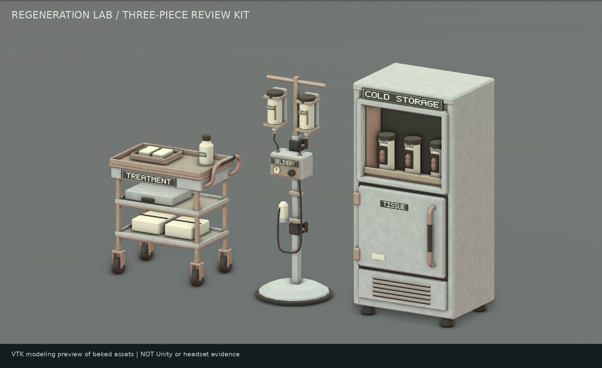

# Regeneration Lab Prop Kit — first asset review

Status: **three real reusable art assets, not a finished room**. Branch: `art/regeneration-lab-prop-kit`. Baseline: `930a8f830cae99e06dcaa0a78ab9edc968c42ae5`. Target: Unity **2022.3.62f3 (96770f904ca7)**, Photon PUN unchanged, **Built-in Render Pipeline**.



## Confirmed theme versus proposed dressing

The Level 1 keycard safe room reveals the facility's regeneration/tissue-damage experiment program. The trolley, delivery stand and cold-storage cabinet are the confirmed first kit. The short labels, muted sample forms, degree of wear and preview arrangement are **proposals for review**, not approved final placements. No subject numbers, staff identity, specific experiment sequence, broken restraints, blood escape trail or direct link to the individual Crawler has been added. Optional waste and diagram props are deferred to keep this kit focused.

There are no runtime scripts on these props, no grabbables, opening drawers/doors, moving carts, specimen AI, audio, lights, networking, transparent materials or custom shaders. The inset specimen display uses opaque containers and small tissue-shaped relief details; it is not a glass simulation. No Level 1 scene or Build Settings change is required or included.

## Asset inventory

All prefab paths are relative to:

`Assets/RunawayChimps/Environment/RegenerationLab/Prefabs/`

| Prefab | Measured width × depth × height | Triangles, including label | Static collision |
| --- | --- | ---: | --- |
| `RGL_TreatmentTrolley.prefab` | 0.842 × 0.518 × 1.022 m | 3,756 | One broad box around the frame/shelves; loose supplies and protruding grip are decorative. |
| `RGL_ChemicalDeliveryStand.prefab` | 0.544 × 0.544 × 1.604 m | 3,202 | Two broad boxes: weighted base and support/regulator volume. No tube or bottle-detail colliders. |
| `RGL_SpecimenColdCabinet.prefab` | 0.824 × 0.732 × 1.7045 m | 3,590 | One broad cabinet-volume box; handle, feet and rear vents do not have tiny colliders. |

**Total: 10,548 triangles, 6 native Mesh assets, 3 unique shared materials, 3 textures, 3 independent prefabs, 4 static BoxColliders.** Each prefab has a three-submesh body plus a separate two-triangle main label: two MeshRenderers, four serialized material slots, but only three unique materials. The other short container labels are baked into the body. These counts are an asset inventory, not a draw-call/frame-time or Quest performance result.

`Meshes/` contains actual serialized native Unity Mesh assets, following the existing KeycardReaders native-mesh convention. `Tools/RegenerationLab/Exports/` contains corresponding Y-up, metre-scale OBJ/MTL authoring companions. Neither import nor runtime reconstructs prop geometry. Each root and mesh child has zero local translation, identity rotation and unit scale. Geometry is already baked around a floor-contact pivot: **+Y up, +Z front/labels**. All major props can be moved, rotated and deleted independently.

The complete per-mesh vertex/triangle/submesh counts, component ranges and measured bounds are in `RegenerationLab.inventory.json` beside the kit. [The read-back report](regeneration-lab-prop-kit-validation.json) records checks and hashes of the produced assets.

## Placement: explicit and reversible

Open a scene normally, select an empty floor-position marker if useful, then run:

**Tools > Runaway Chimps > Environment > Place Regeneration Lab Review...**

The window lets you choose the **loaded target scene**, enter a **world-space floor anchor** and facing yaw, and press **Place NEW review arrangement**. Selection is only an optional source of coordinates; nothing selected is moved or parented. The menu does not raycast an assumed floor, open Level 1, save a scene or decide a final layout. Exit Play Mode and Prefab Mode before placing.

The result is a uniquely named scene-root group containing three linked prefab instances. Relative starts are trolley `(-1.05, 0, 0)`, stand `(0, 0, 0.10)`, cabinet `(1.0, 0, 0)` in metres. Its conservative envelope is approximately **2.9 × 0.8 m**, but that is not walking clearance. Each click creates a **new** group and leaves every prior placement/override alone. Undo removes only that operation; Redo should restore the same linked instances. Importing/reopening Unity performs no placement. Save or discard the scene yourself after review.

You can also drag any individual prefab from the Project window into a scene without using the arrangement. Avoid scaling a parent: position and yaw the unit-scale props instead. No combined prefab asset is needed, and no permanent relationship between the three placements is enforced.

## Source-inspected scale and layout boundary

Inspected `Assets/Scenes/Level1_Containment.unity` at the pinned baseline, specifically `Level1Root/SmallRoom`, its floor/wall/ceiling prefab instances and native mesh overrides. A sampled floor tile is at world **Y=2**, with local half-thickness **0.005 m**, so its top is **Y=2.005**, not world zero. This is why the placement window asks for a floor point and does not silently use the room group's origin. Verify the particular patch of floor you choose; this number is not a global placement rule.

The inspected `KeyCards/KeyCard2` world pose is `(-7.05, 2.8, -23.25)` and is unchanged. Do **not** move it onto the trolley as part of trying the kit. Keep both vent approaches, safety transitions, all fixed cards/readers and arrival paths clear. No existing wall, floor, safe trigger, door, card or monster object is touched by the placement command.

The persistent `Bootstrap.unity` Gorilla rig/root and assigned collider transform use unit scale. The actual assigned enabled body capsule is radius **0.15 m**, height **0.5 m**, and the head sphere radius is **0.15 m**. A different disabled capsule on the player root is not the active body. `Player.cs` enforces a minimum visual hand-contact radius of **0.05 m** and uses a **1.5 m** maximum arm-length setting. The XROrigin's serialized **1.1176 m** camera offset is not a guaranteed tracked eye height. Those inspected references inform the cart's approximately **0.81 m** working deck and the 1.6–1.7 m tall storage/delivery silhouettes; headset scale is still a required test.

## Materials, textures and label editing

| Shared material | Texture | Starting controls |
| --- | --- | --- |
| `RGL_PaintedMetal.mat` | `PaintWear.png`, 512 × 512 RGB | Standard albedo tint `(0.58, 0.66, 0.62)`; metallic `0.12`; smoothness `0.26`. |
| `RGL_DullSteel.mat` | `SteelBrush.png`, 512 × 512 RGB | Albedo tint `(0.76, 0.79, 0.78)`; metallic `0.65`; smoothness `0.32`. |
| `RGL_PolymerAndLabels.mat` | `PolymerLabels.png`, 1024 × 1024 RGB | White tint; metallic `0`; smoothness `0.22`. Dark rubber, pale containers, small muted tissue areas and high-contrast labels share protected atlas regions. |

All are assigned serialized **opaque Standard** materials with `_Mode=0`, depth writing on, no emission and no runtime material instances. Paint/steel repeat; the atlas clamps. Textures are sRGB albedo, mipmapped, not CPU-readable, with an explicit Android **ASTC 6×6** import setting. This is a starting compression choice, not measured Quest acceptance. No normal, metallic or occlusion texture maps are required. The meshes retain readable vertex data for inspection; that CPU copy must be included in memory profiling.

Adjust shared material tint/metallic/smoothness in the Inspector. To make a per-prop art variant, duplicate a material deliberately rather than adding a runtime material-copy component. The main `EditableLabel` child is separate so its mesh/material can be replaced or disabled without rebuilding the body.

The atlas PNG is directly editable in an image editor. `Labels.json` stores the short text choices, and `Tools/RegenerationLab/geometry.py` records each atlas rectangle. For reproducible changes, edit a copy of that JSON and run the offline generator with `--labels <file>` into a **new directory**. Copy only the resulting atlas PNG back after review, preserving the existing `.meta`; generating a replacement label texture does not require replacing meshes or scenes. The original 5×7 lettering source supports uppercase A–Z and spaces, rejects overlong labels, and needs no installed font. Label text is art proposal, not lore. Do not recolor the entire polymer material to change just one label or use hue alone to identify a prop.

The body meshes have valid UV0 with protected atlas regions and repeated metal charts. They do **not** include a lightmap UV1. The prefabs use light probes and are not automatically marked Contribute GI, Navigation Static or occluders. A future lightmapped placement needs a deliberately authored non-overlapping UV1 and a new bake/validation pass; do not just enable lightmap contribution and assume the overlapping UV0 is suitable.

## Executed validation and previews

The offline validator reads the **saved native Mesh bytes back**, independently of the authoring geometry functions. It checks finite data, index bounds/ranges, nonzero triangle/UV area, face winding versus normals, unit normals, orthogonal tangents, serialized bounds, dimensions, floor pivots, exact prefab mesh/material assignments, broad collider bounds, local object references and GUID/importer integrity. Texture PNGs decode at the reported sizes and are opaque RGB. No Rigidbody, behavior, audio or Light component is allowed in the prefabs.

Nine negative controls deliberately reverse normals, swap the Standard shader, enable transparency, remove metadata, scale a transform, enlarge a collider, turn collision into a trigger, invalidate a native importer fileID and insert a scene-save hook; all must be rejected. The authoring command also refuses an existing output directory. Source inspection is not Unity execution.

The actual produced assets were visually inspected using **VTK 9.6.2** offscreen rendering, including their saved normals, UVs, material tints/roughness and referenced PNGs, from front/rear and individual views. An early cabinet-handle curve folding defect and tube atlas-mip bleed were corrected before delivery. Frame/handle joins, feet, tray contents, tubing, display recess and label planes were reviewed for obvious clipping; joined closed parts deliberately intersect at physical mounting points. This is not an exhaustive mathematical self-intersection proof. No core prop is being delivered as an uninspected placeholder/blockout.

[Front arrangement](images/regeneration-lab/kit-front.png) · [Rear arrangement](images/regeneration-lab/kit-rear.png) · [Trolley](images/regeneration-lab/RGL_TreatmentTrolley.png) · [Delivery stand](images/regeneration-lab/RGL_ChemicalDeliveryStand.png) · [Cabinet](images/regeneration-lab/RGL_SpecimenColdCabinet.png)

These are **modeling-tool previews, not Unity screenshots, gameplay captures or headset evidence**. The studio environment, lighting, ambient occlusion and floor exist only in the renderer. They are not props, scene lights or an approved Level 1 lighting setup. The render script loads the published native assets rather than constructing substitute preview geometry.

## Reproduce and inspect without touching authored scenes

Install the offline requirements in a separate Python environment; Unity does not need them:

```bash
python -m pip install -r Tools/RegenerationLab/requirements.txt
python Tools/RegenerationLab/validate.py --root . --baseline .
python Tools/RegenerationLab/tests.py --root .
# Produces a separate, NEW folder; refuses an existing folder.
python Tools/RegenerationLab/generate.py --output /tmp/regeneration-review
python Tools/RegenerationLab/render.py --root . --out /tmp/regeneration-previews
```

`generate.py`, `geometry.py`, the source label data and the Editor template are offline authoring sources, not runtime geometry. The `write_docs.py` one-time checkpoint patch refuses duplicate insertion; do not rerun it as a general documentation updater. The read-only kit CI runs the validator and negative controls; it does not regenerate assets or change scenes. The repository's existing **Source integrity** PR check remains separate and covers the full project source/scene contracts.

In Unity run **Tools > Runaway Chimps > Environment > Validate Regeneration Lab Kit**. It inspects imported asset references, mesh data, identity transforms, Standard materials and static-only components without changing assets or scenes. **This Unity command has not been executed in the authoring container.** Neither that command nor a green source CI check establishes headset or performance acceptance.

All geometry, textures, atlas lettering and the preview studio environment are original work for this repository. No third-party models, downloaded textures/HDRIs or font binaries are included. NumPy, Pillow and VTK are offline tools, not vendored runtime dependencies or Unity package changes. Preview captions may use an installed system font; no font file is distributed.

## Acceptance checklist — still pending

- [ ] **Unity import/rendering:** open 2022.3.62f3; no new Console import/compile errors, missing GUIDs or magenta materials. Run the read-only kit validator; inspect all sides, labels, texture seams and normals in Scene and Play views.
- [ ] **Placement and preservation:** choose a non-active loaded scene and verify only it receives the new group. Repeat the command without altering the first group's transforms/overrides. Test Undo/Redo, independent move/rotate/delete, prefab links, rejection in Play/Prefab Mode, and no changes/saves merely from restarting Unity.
- [ ] **Player-relative scale/readability:** judge the 0.81 m cart working surface and tall equipment using the actual Gorilla rig while standing/crouching. Read the main prop labels under Level 1 lighting; secondary container markings may need enlarged atlas text. Do not add lights simply to match the VTK studio render.
- [ ] **Safe-room navigation/objectives:** preserve both vent routes, head-based safe transitions, fixed card access, readers, doors and arrival markers. No Crawler behavior changes. Try approaching/leaving from both routes with the chosen final placements.
- [ ] **Collision comfort:** test Gorilla hands/head/body against every side, cart rim, stand base and cabinet. Broad proxies intentionally close shelf/display voids and omit tiny details; reject invisible ledges, uncomfortable stand-base steps, trapping or launches. Reposition or simplify colliders rather than adding dozens of small collision shapes.
- [ ] **Quest performance:** profile baseline versus the selected placed arrangement on target hardware under actual game lighting: CPU/GPU frame time, material/draw batching, texture/mesh memory (including readable meshes), physics cost and visual shimmer. No Quest measurements, frame-rate claim, Android build or full-session capacity pass is supplied by this asset inventory.

Final dressing, layout approval, lighting and room completion remain open after these reusable assets are imported.
